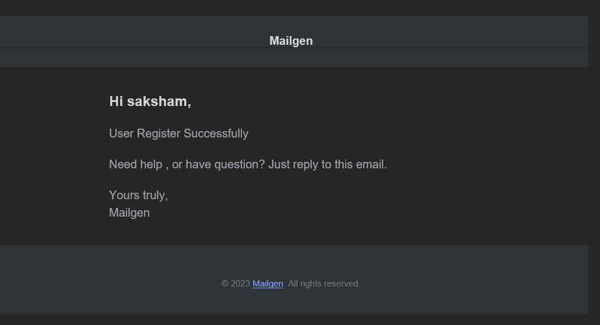

# AuthSecure🔒

It is an Authentication app using using JSON web token. It is developed using MERN stack. Whenever a user register for the very first time, it receives the "successfully registered" email on the user email.
If the user wants to change the password, it can be changed using the OTP that will also be sent on the user email through nodemailer.

 

# Features

- Register User 
- Login User
- Reset Password
- Update User
- Logout 

## Register
 

 **Sucessfully registerd** will be sent on the user Email

 
</img>  

 
 </img>

 

## Updating User

 
 </img>

 

## Reset Password

User will recieve the OTP on its registerd email 

 
 </img>

 
 </img>

 

## Mobile View

 </img>

## Technology

- React 
- Express
- MongoDB
- Tailwind CSS
- Redux
- Node mailer

Made by : -  [Susaksham](https://twitter.com/Susaksham08) 